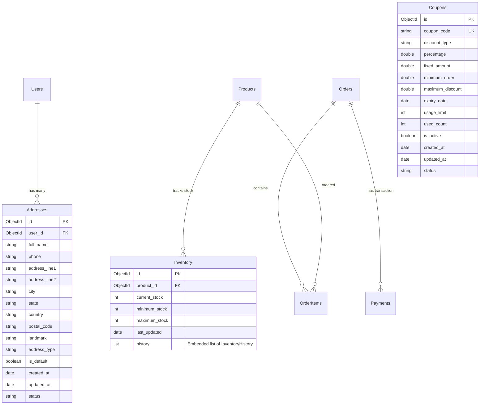
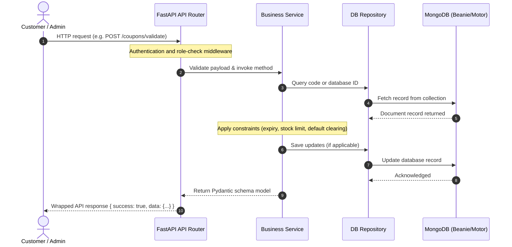
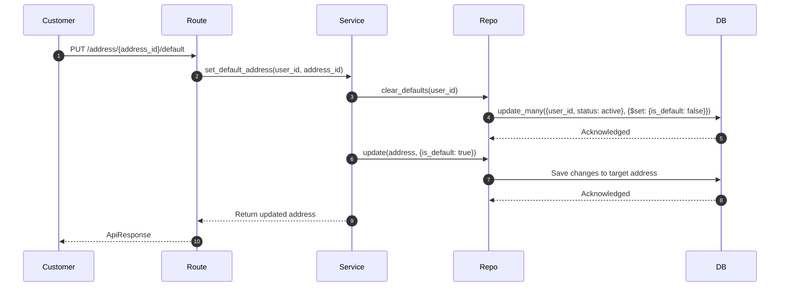
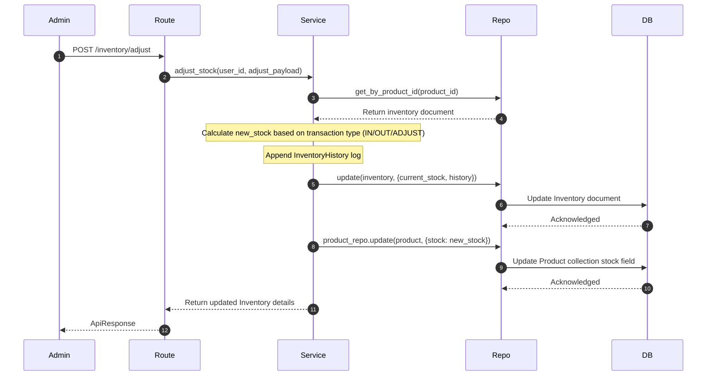

# CloudCrackers Backend - Phase 6 Documentation

This document explains the architectures, entity associations, transaction processing, and aggregation pipelines implemented in **Phase 6: Address, Coupon, Inventory & Admin Analytics Dashboard**.

---

## 1. Folder Structure

The newly created files are structured as follows:

```
backend/
├── app/
│   ├── api/
│   │   └── v1/
│   │       ├── address/
│   │       │   └── address.py (CRUD Shipping & Billing Addresses)
│   │       ├── admin/
│   │       │   └── dashboard.py (Admin Analytics Metrics API)
│   │       ├── coupons/
│   │       │   └── coupons.py (Coupons Admin CRUD & Customer validation)
│   │       └── inventory/
│   │           └── inventory.py (Admin Stock adjust & alerts)
│   ├── models/
│   │   ├── address.py (Address Beanie Document)
│   │   ├── coupon.py (Coupon Beanie Document)
│   │   └── inventory.py (Inventory Beanie Document with Embedded History Logs)
│   ├── repositories/
│   │   ├── address_repository.py
│   │   ├── coupon_repository.py
│   │   └── inventory_repository.py
│   ├── schemas/
│   │   ├── address.py (Pydantic models)
│   │   ├── coupon.py (Pydantic models)
│   │   └── inventory.py (Pydantic models)
│   └── services/
│       ├── address_service.py
│       ├── coupon_service.py
│       ├── inventory_service.py
│       └── dashboard_service.py (MongoDB Aggregation pipelines)
└── tests/
    ├── test_address.py
    ├── test_coupon.py
    ├── test_inventory.py
    └── test_dashboard.py
```

---

## 2. Collection & ER Diagram (Mermaid)

Below is the database relationship diagram mapping the new collections (`Addresses`, `Coupons`, and `Inventory`) alongside existing collections:



---

## 3. Request Flow Diagram (Mermaid)



---

## 4. Sequence Diagrams

### 4.1 Address Default Toggle Flow
When a user sets an address as default, all other addresses owned by that user must automatically have their default flags removed.



### 4.2 Stock Adjustment & Product Sync Flow
Modifying stock logs an entry in the Inventory history list and updates the `stock` attribute of the `Product` collection.



---

## 5. MongoDB Aggregation Dashboard Pipelines

The dashboard analytics API aggregates multiple counters using PyMongo/Motor's cursor pipelines to avoid memory overhead in Python.

### 5.1 Top Selling Products Grouping
Group order items by `product_id`, sum quantities, and multiply values:
```python
top_prod_pipeline = [
    {"$group": {
        "_id": "$product_id",
        "total_quantity": {"$sum": "$quantity"},
        "total_revenue": {"$sum": {"$multiply": ["$quantity", "$price"]}}
    }},
    {"$sort": {"total_quantity": -1}},
    {"$limit": 5}
]
```

### 5.2 Top Category Revenue Grouping
Join `OrderItem` with the `Product` collection using `$lookup` and `$unwind`, then group sales by category:
```python
top_cat_pipeline = [
    {"$lookup": {
        "from": "Products",
        "localField": "product_id",
        "foreignField": "_id",
        "as": "product"
    }},
    {"$unwind": "$product"},
    {"$group": {
        "_id": "$product.category_id",
        "sales_count": {"$sum": "$quantity"},
        "revenue": {"$sum": {"$multiply": ["$quantity", "$price"]}}
    }},
    {"$sort": {"sales_count": -1}},
    {"$limit": 5}
]
```

---

## 6. Interview Questions & Study Guide

### 6.1 MongoDB Aggregations
* **Question 1**: Why is it crucial to use MongoDB Aggregations for e-commerce dashboards instead of Python loops?
  * *Answer*: Processing data in python memory requires streaming millions of orders across the network, leading to high latency and RAM consumption. Aggregations run natively on the MongoDB engine, taking advantage of database indexing, sharding, and memory allocation.
* **Question 2**: How does the `$expr` operator enable field-to-field comparisons inside standard queries?
  * *Answer*: Normal queries like `{"current_stock": {"$lte": "$minimum_stock"}}` treat the string `"$minimum_stock"` as a literal. The `$expr` operator tells MongoDB to parse it as a field value expression.

### 6.2 FastAPI & Dependency Design
* **Question 3**: How did we bypass Beanie's Motor compatibility TypeError during aggregation?
  * *Answer*: In Motor 3.7+, cursor execution changes made Beanie's internal aggregate query wrapper trigger a TypeError. We bypassed this by accessing the raw Motor collection (`model.get_pymongo_collection()`) directly and calling `.aggregate().to_list()`.

### 6.3 Performance Tuning Checklist
1. **Database Indexes**: Added indexes to `Address.user_id` and `Inventory.product_id` to speed up checkout validation queries.
2. **MongoDB Expression Caches**: Used `$match` at the start of aggregation pipelines to filter out cancelled orders before executing `$group` pipelines.
3. **Pydantic Validation Performance**: Applied `model_validator` validators to prevent invalid requests (like expired coupons or out of bound stock values) from reaching the service/database layer.
