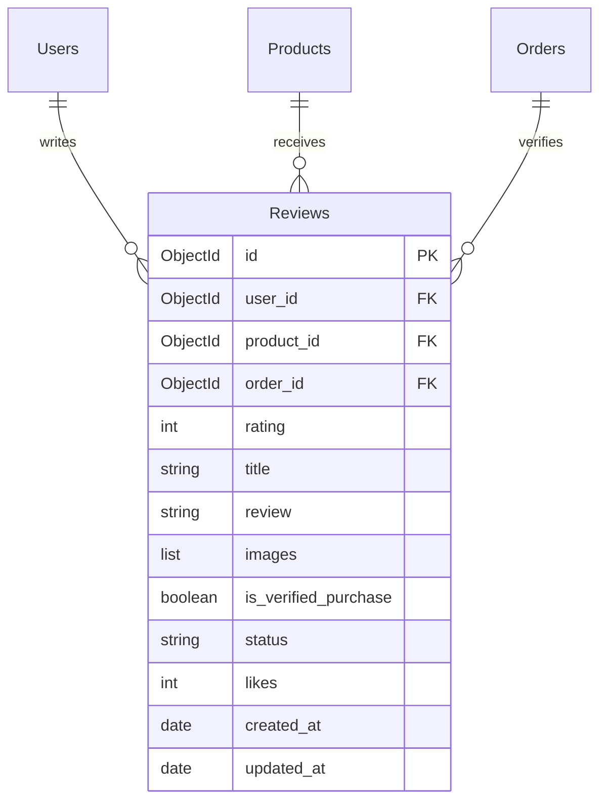
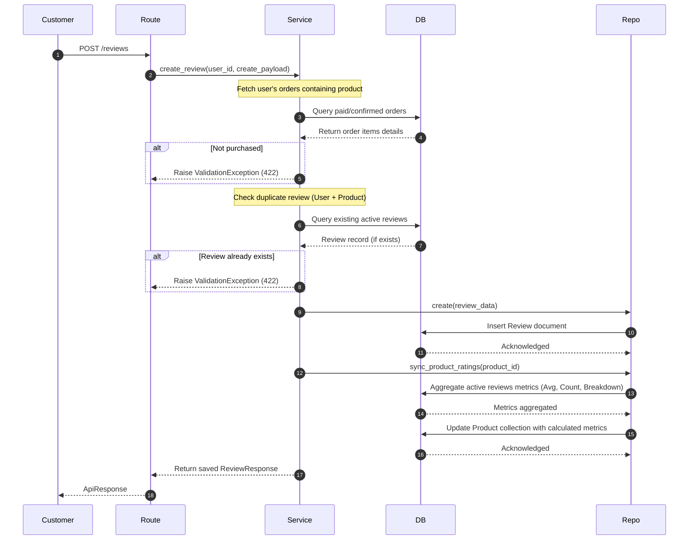
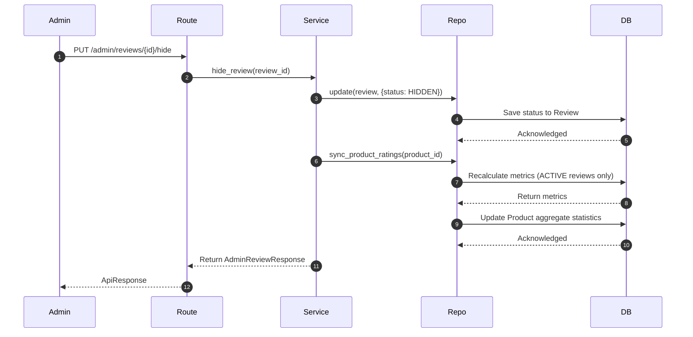

# CloudCrackers Backend - Phase 7 Documentation

This document explains the architectures, entity associations, database schemas, and calculation pipelines implemented in **Phase 7: Review & Rating Module**.

---

## 1. Folder Structure

The newly created files are structured as follows:

```
backend/
├── app/
│   ├── api/
│   │   └── v1/
│   │       └── reviews/
│   │           └── reviews.py (CRUD Reviews public/admin APIs)
│   ├── models/
│   │   └── review.py (Review Beanie Document with indexed constraints)
│   ├── repositories/
│   │   └── review_repository.py
│   ├── schemas/
│   │   └── review.py (Pydantic models)
│   └── services/
│       └── review_service.py (Order purchase checking & ratings sync)
└── tests/
    └── test_review.py
```

---

## 2. Collection & ER Diagram (Mermaid)

Below is the database relationship diagram mapping the new collections `Reviews` alongside existing collections:



---

## 3. Sequence Diagrams

### 3.1 Reviews Submission Flow
Verified purchase constraint check, duplicate checking, and auto-updating aggregates:



### 3.2 Review Moderation Flow
When an admin hides a review, it immediately recalculates and updates the Product rating aggregates to ensure hidden review ratings do not count towards the product average rating.



---

## 4. MongoDB Aggregator Statistics Calculations

The repository layer utilizes a single `$facet` aggregation pipeline to calculate statistics:

```python
pipeline = [
    {"$match": {"product_id": pid, "status": "ACTIVE"}},
    {
        "$facet": {
            "stats": [
                {
                    "$group": {
                        "_id": None,
                        "average_rating": {"$avg": "$rating"},
                        "total_reviews": {"$sum": 1},
                        "verified_purchases": {
                            "$sum": {"$cond": ["$is_verified_purchase", 1, 0]}
                        },
                    }
                }
            ],
            "breakdown": [{"$group": {"_id": "$rating", "count": {"$sum": 1}}}],
        }
    },
]
```

---

## 5. Interview Questions & Study Guide

### 5.1 MongoDB Aggregations
* **Question 1**: What is the purpose of `$facet` in MongoDB aggregation pipelines?
  * *Answer*: `$facet` allows executing multiple aggregation pipelines in parallel within a single stage on the same input documents. This lets us calculate general summary metrics (average rating, review count) and rating distribution breakdowns (1-5 star counts) in a single database round-trip.

### 5.2 Python & Beanie Design
* **Question 2**: How does storing rating metrics directly on the `Product` document optimize catalog retrieval?
  * *Answer*: If we calculated ratings on-the-fly when listing products, MongoDB would have to perform index lookups and averages on the `Reviews` collection for every single product in the list, causing $O(N)$ query overhead. Storing pre-calculated aggregates directly on the product document simplifies list scans to $O(1)$ reads.

### 5.3 Best Practices & Performance Tips
1. **Match Filter Optimization**: Always place `$match` filters at the very beginning of aggregate pipelines. Filtering on index fields (`product_id`, `status = ACTIVE`) significantly limits the set of scanned records.
2. **Synchronized Updates**: Enforce statistics updates using transactional triggers inside the service layer whenever reviews are created, updated, hidden, restored, or deleted.
