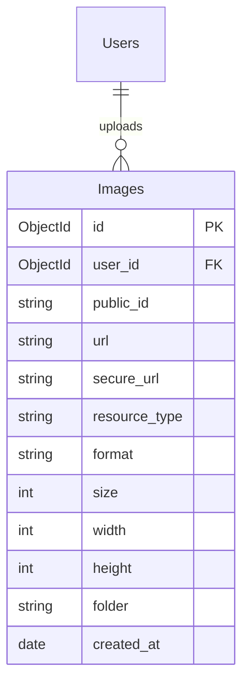
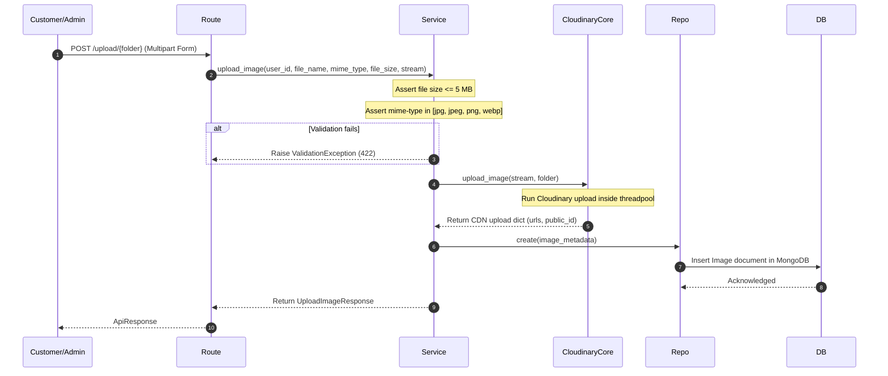
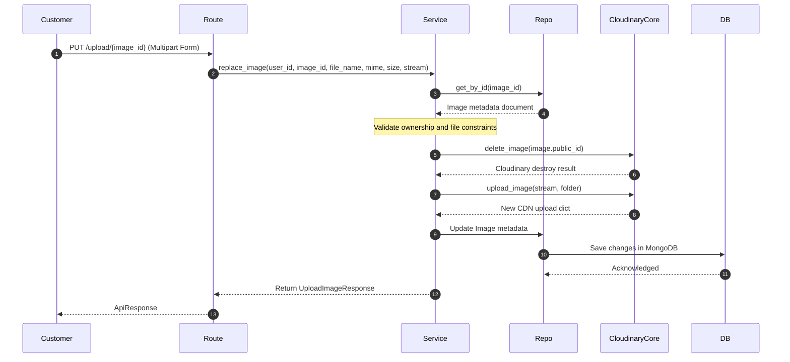

# CloudCrackers Backend - Phase 8 Documentation

This document explains the designs, upload validations, and database structures implemented in **Phase 8: Image Upload Module (Cloudinary)**.

---

## 1. Folder Structure

The newly created files are structured as follows:

```
backend/
├── app/
│   ├── api/
│   │   └── v1/
│   │       └── upload/
│   │           └── upload.py (Product, Profile, and Review upload/delete APIs)
│   ├── core/
│   │   └── cloudinary.py (Cloudinary SDK wrapper + async threadpool helpers)
│   ├── models/
│   │   └── image.py (Image Beanie Document representing stored metadata)
│   ├── repositories/
│   │   └── image_repository.py
│   ├── schemas/
│   │   └── image.py (Pydantic models)
│   └── services/
│       └── image_service.py (Mime checks, size limits, and replace rules)
└── tests/
    └── test_upload.py
```

---

## 2. Collection & ER Diagram (Mermaid)

Below is the database relationship diagram mapping the new collection `Images` alongside existing collections:



---

## 3. Sequence Diagrams

### 3.1 Image Upload Flow
FastAPI intercepts multiform files, reads streams, runs validation rules (under 5 MB, allowed formats), and sends them to Cloudinary.



### 3.2 Image Replacement Flow
Replacing deletes the previous image from Cloudinary using `public_id` and uploads the new one, keeping the MongoDB ID unchanged.



---

## 4. Cloudinary Multi-Threaded Wrapper Helper

Since the Cloudinary SDK is a blocking network client, running it directly inside FastAPI async endpoints would block the event loop. We wrap it using `starlette.concurrency.run_in_threadpool`:

```python
async def upload_image(file_data: Any, folder: str = "cloudcrackers") -> Dict[str, Any]:
    return await run_in_threadpool(
        cloudinary.uploader.upload,
        file_data,
        folder=folder,
    )
```

---

## 5. Interview Questions & Study Guide

### 5.1 FastAPI File Handling
* **Question 1**: How does FastAPI handle file uploads using `UploadFile`?
  * *Answer*: FastAPI's `UploadFile` utilizes a `SpooledTemporaryFile` which caches small uploads (under 1 MB) in memory, and spills larger files to temporary files on disk. This prevents memory leaks. We retrieve the raw stream by calling `await file.read()`.

### 5.2 Async Event Loop Blocking
* **Question 2**: Why is it important to wrap Cloudinary uploader calls in `run_in_threadpool`?
  * *Answer*: Cloudinary SDK uses standard synchronous HTTP requests. If we called it directly inside an `async def` endpoint, it would block the Python event loop, preventing FastAPI from processing any other incoming concurrent requests. `run_in_threadpool` delegates the execution to a worker thread.
